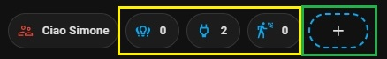

<h2 class="heading-element" dir="auto" tabindex="-1">➕ Sum of Entities for home assistant</h2>

I wanted to share a board I created, thanks to various expert guides found online, to manage my Samsung Q70 55&rsquo; TV

Instructions:

<ol dir="auto">
<li>in HA create the label: Luci, prese, presenza ecc. (mine have these names in Italian) if you change them, in the sensor file where you then adapt them</li>
<li>from Hacs, install: a. bubble-card</li>
<li>in the HA file sensor.yaml, insert the contents of sensor.txt (READ the first line), if you do not have the file: a. you must create sensor.yaml in the config/ folder b. open the file configuration.yaml and insert this line: sensor: !include sensor.yaml</li>
<li>create a new badge in HA (see image below, green square) and select entities: sensor.luci_accese (to sum up the lights on) or prese_accese (to sum up the switch on) or presences</li>
</ol>

ok! now we got that (see image below, Yellow square):

Now to be able to see which lights are on we have to do this:

https://github.com/user-attachments/assets/732f33bd-28df-49fd-9899-c3f87ad6aefe

second part in update ...
<ol dir="auto">
<li>a</li>
<li>b</li>
<li>c</li>

----------------------------------------

Would you like to give me a hand? The content of this page is completely free of charge and the purpose is certainly not to make money. If you would like to lend me a hand to help with expenses and lost time, you have the following ways:

Make your Amazon purchases from this link:

Join our Telegram channel dedicated to Home Assistant news:

Join our Telegram channel dedicated to home automation products, there are lots of offers:

